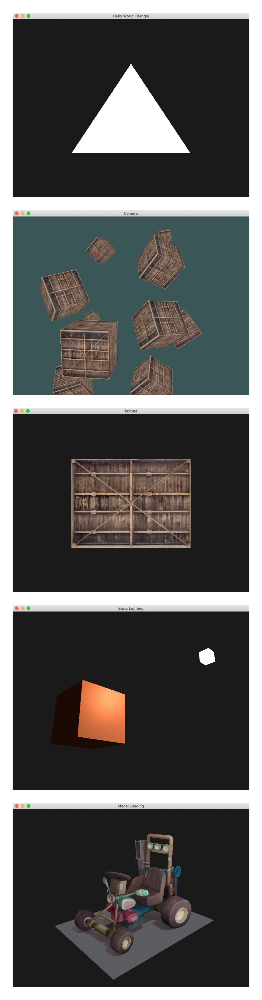

some code samples I have done during my study of OpenGL.

all samples are compiled successfully on my laptop(MacBook Pro 15 late 2013, 10.14.6, NVIDIA GeForce GT 750M).

to compile:

first install dependencies: `gcc`, `glfw3`, `glm` and `assimp`. all can be installed with `homebrew`.

then simply run `make` at root folder and check out all excutables.

* `the-hello-world-triangle/app`
* `texture/app`
* `camera/app`
* `lighting/app`
* `model_loading/app`

